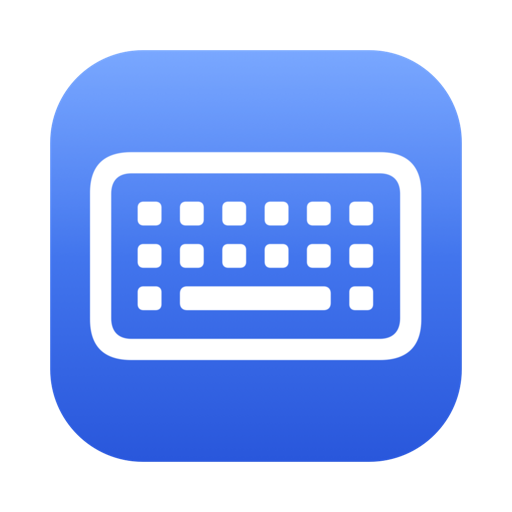
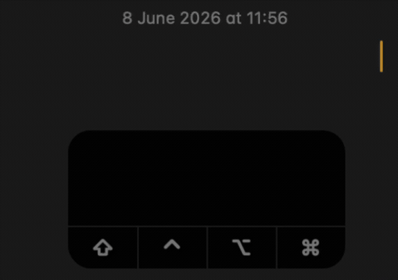

<div align="center">



# Kright

**Keyboard done right.** · by [Walter Apps LTD](#made-by)

[](#)
[](Mac/)
[](Windows/)
[](https://github.com/walteryaron/Kright/releases)
[](LICENSE)



</div>

A lightweight **native desktop keyboard utility** for **macOS and Windows** that
runs from the menu bar / system tray. Its main job: fix text you typed in the
**wrong keyboard layout** (e.g. you meant `exit` but typed `קסןא` because Hebrew
was active) — with a global hotkey, in place, in any app. It can also
**auto-switch the keyboard to English** when you focus an email / URL / password
field.

There is **no shared/cross-platform code** — each OS has its own native app:

| Platform | Stack | Folder |
|----------|-------|--------|
| macOS    | Swift + SwiftUI | [`Mac/`](Mac/) |
| Windows  | C# + WPF (.NET 8) | [`Windows/`](Windows/) |

## Download

Grab the latest **signed** build — no build tools required:

| Platform | Download |
|----------|----------|
| **macOS** 13+ | [**Kright.dmg**](https://github.com/walteryaron/Kright/releases/latest/download/Kright.dmg) |
| **Windows** 10+ | [**Latest installer (.exe)**](https://github.com/walteryaron/Kright/releases/latest) |

Or browse [all releases](https://github.com/walteryaron/Kright/releases). Once
installed, Kright **keeps itself up to date automatically** (signed in-app
updates — see the [changelog](CHANGELOG.md)).

## Features

- **Wrong-layout fix** — converts the focused field's last word using the
  *real* installed keyboard layouts (macOS `UCKeyTranslate` / Windows
  `ToUnicodeEx`), so it matches exactly what your keyboard types, for any
  language pair.
- **Global hotkey** — fix in place from anywhere (default `⌃⌥K` on macOS,
  `Ctrl+Alt+K` on Windows), configurable in Settings.
- **Terminal / console support** — when a field rejects accessibility writes
  (Terminal, iTerm, cmd, PowerShell), it falls back to simulated keystrokes.
- **Switches the keyboard after a fix** — so you keep typing in the corrected
  language instead of producing more gibberish.
- **Auto-fix mode** (opt-in) — convert wrong-layout words automatically as you
  finish them (on Space / Tab), no hotkey needed.
- **Auto keyboard language** — optionally switch to a Latin layout on email / URL
  / password fields (only when the current layout is non-Latin).
- **Per-app keyboard rules** — assign a target language to any app; Kright
  switches automatically the moment that app gains focus (e.g., always Hebrew
  in your notes app, always English in your terminal).
- **Layouts shown by language** — everywhere Kright lists keyboards it names
  them by language, like System Settings ("English", "Hebrew") — not by
  macOS's cryptic layout names ("ABC", "U.S.", "British").
- **Private by design** — no network, nothing stored, and password / secure
  fields are never read (you can watch capture pause in the Key Log).

## How the App Works

Kright runs quietly in the **menu bar** (macOS) / **system tray** (Windows) and
starts when you log in. It passively watches the keys you type — never recording
them — only so it knows the exact characters of the word you're typing right now.
When you press the magic key combination, it converts that text from the wrong
layout to the right one, **in place**, and switches your keyboard to the corrected
language so you can keep going.

The basic steps:

1. Type some text using an incorrect layout (you meant Hebrew, but English was
   active → gibberish — or the other way around).
2. Realize your mistake.
3. Press the magic key combination (default **⌃⌥K** on macOS, **Ctrl+Alt+K** on
   Windows — configurable in Settings).
4. Kright replaces the wrong-layout text with the correct text **and switches the
   keyboard** to match.
5. Keep typing — you're now in the right layout. Profit.

**No need to select the text first** — Kright already knows what you just typed,
so there's no Ctrl+A / ⌘A step. It uses your *real* installed keyboard layouts to
translate, so the result matches exactly what your keyboard produces, for any
language pair. It looks at the current layout to decide how to convert, so don't
change the layout before pressing the hotkey — Kright changes it for you.

**How it puts the text back:** in normal editable fields it writes the correction
directly through the OS accessibility API — the clipboard is never touched. In
terminals / consoles that don't allow that, it falls back to simulating
keystrokes: it deletes the wrong text and pastes the correction, saving and
restoring whatever was on your clipboard around it. (It can't guarantee
restoration, and non-text clipboard data — a file or a picture — isn't restored.)

**Auto-fix mode** (opt-in): instead of pressing the hotkey, turn this on and
Kright checks each word as you finish it (on Space / Tab). If it looks like
wrong-layout gibberish, it converts it and switches the keyboard automatically.

Everything happens **on your device** — no network, nothing stored, and
password / secure fields are never read. See the [changelog](CHANGELOG.md).

## For developers

<details>
<summary><b>Build &amp; run from source</b></summary>

**macOS** (needs Xcode + [XcodeGen](https://github.com/yonaskolb/XcodeGen)):
```sh
cd Mac
xcodegen generate
xcodebuild -project Kright.xcodeproj -scheme Kright -configuration Debug -derivedDataPath build build
open build/Build/Products/Debug/Kright.app
```
Grant **Accessibility** permission (System Settings → Privacy & Security →
Accessibility → enable Kright).

**Windows** (needs the .NET 8 SDK — see [`Windows/README.md`](Windows/README.md)):
```powershell
cd Windows
dotnet build
dotnet run
```

### Tests

Pure-logic unit tests (conversion tables, script + language detection):
```sh
# macOS (XCTest)
cd Mac && xcodebuild test -project Kright.xcodeproj -scheme Kright -destination 'platform=macOS'
```
```powershell
# Windows (xUnit) — run on Windows; the WPF app only builds there
dotnet test Windows/Tests/Kright.Tests.csproj
```

</details>

<details>
<summary><b>Packaging installers</b></summary>

**macOS — `.dmg`** (run on a Mac with Xcode):
```sh
brew install create-dmg       # one-time: styled "drag to Applications" window
cd Mac
./scripts/build-dmg.sh        # → build/Kright.dmg
```
The DMG shows a custom background (`scripts/gen-dmg-bg.swift`: light panel + a
"›" chevron) with the app icon left and Applications right. `create-dmg` drives
Finder to author the window — on the **first run it prompts "Terminal wants to
control Finder"; approve it** (the layout can't be written otherwise on macOS
26+). It falls back to `dmgbuild` (headless, but its background may not render on
macOS 26) or a plain DMG if neither tool is installed.
If a **Developer ID Application** certificate and a stored notary profile
(`kright-notary`) are present, the script automatically signs (hardened runtime),
**notarizes**, and **staples** the DMG, so it opens with a normal double-click
anywhere. The one-time setup (create the cert in Xcode; `notarytool
store-credentials`) is documented at the bottom of `scripts/build-dmg.sh`.
Without them it falls back to a dev-signed DMG whose first launch needs a
right-click → Open.

**Windows — installer `.exe`** (run on Windows; needs the
[.NET 8 SDK](https://dotnet.microsoft.com/download) and
[Inno Setup 6](https://jrsoftware.org/isdl.php)):
```powershell
cd Windows
powershell -ExecutionPolicy Bypass -File .\build-installer.ps1
# → installer\output\KrightSetup-1.0.1.exe
```
This publishes a **self-contained** x64 build (the .NET runtime is bundled, so
end users install nothing extra) and wraps it in a per-user installer (no UAC),
with optional "start at login".

</details>

## Privacy

**Kright doesn't collect your keystrokes — nothing is recorded, stored, or sent
anywhere. No internet. No cloud. No AI service. No telemetry. Nothing.**
Everything happens on your own device, and only to fix the word you just typed. Password and secure fields are
never read. Because the whole app is open source, every one of these claims is
verifiable in this repo.

## Common Questions

**Does Kright record, log, or upload my keystrokes?**
No — never. It looks at only the current word, in memory, to correct the layout.
Nothing you type is written to disk, and it makes **zero** network requests.

**Does it use the internet, a cloud, or an AI service?**
No. There is no networking code anywhere in the app — no internet, no cloud, no
AI, no analytics. It works fully offline. (Detection uses a tiny on-device
statistical model, not a remote service.)

**Can it see my passwords?**
No. The moment a password or secure field is focused, Kright stops listening
entirely — you can watch this live in the Key Log ("Paused — not capturing"). On
macOS the operating system *also* blocks every app from reading secure fields.

**Does it work in any app?**
Yes — browsers, native apps, and terminals/consoles (it falls back to simulated
keystrokes where direct edits aren't allowed).

**Which languages does it support?**
The wrong-layout fix works for any installed non-Latin ⇄ Latin layout pair (it
reads your real layouts). The smart "is this gibberish?" detection (used by the
confidence verdict and Auto-fix mode) ships on-device models for **English,
Hebrew, Russian, Ukrainian, Bulgarian, Serbian, Macedonian, Greek, Persian,
Armenian, and Georgian** — adding a language is just bundling one more table.

**Is it open source?**
Yes — the entire app is in this repository, so you can confirm the privacy claims
yourself.

## Made by

**Walter Apps LTD** — Kright, *keyboard done right*.

## License

MIT License · Copyright © 2026 Walter Apps LTD. See [LICENSE](LICENSE).
